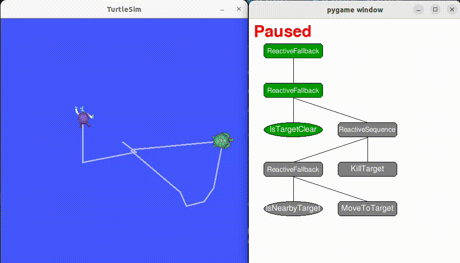

# Example: Turtle Catcher

A minimal example showing how to use the Behaviour Tree runtime with ROS 2 through a turtlesim scenario.

In this scenario, `turtle1` is controlled by a Behaviour Tree that enables it to autonomously track and catch a target turtle (`turtle_target`). The target turtle can be manually controlled via keyboard input, while `turtle1` uses the Behaviour Tree logic to pursue and follow the target's movements in real-time.


## How to Run 

Launch Turtlesim
```
ros2 run turtlesim turtlesim_node
```

Spawn a Target Turtle
```
ros2 service call /spawn turtlesim/srv/Spawn "{x: 5.5, y: 5.5, theta: 0.0, name: 'turtle_target'}"
```

Teleoperate the Target Turtle
```
ros2 run turtlesim turtle_teleop_key --ros-args -r /turtle1/cmd_vel:=/turtle_target/cmd_vel
```

Move the spawned turtle using keyboard input
(The original turtle /turtle1 will be controlled by Behaviour Tree)


Run Turtle1 Action Server
```
python3 ./scenarios/turtle_catcher/action_servers/turtle_nav_action_server.py --ns /turtle1
```

Run Behaviour Tree Controller
```
python3 main.py --config=scenarios/turtle_catcher/configs/config_turtlesim.yaml
```

## Demo



